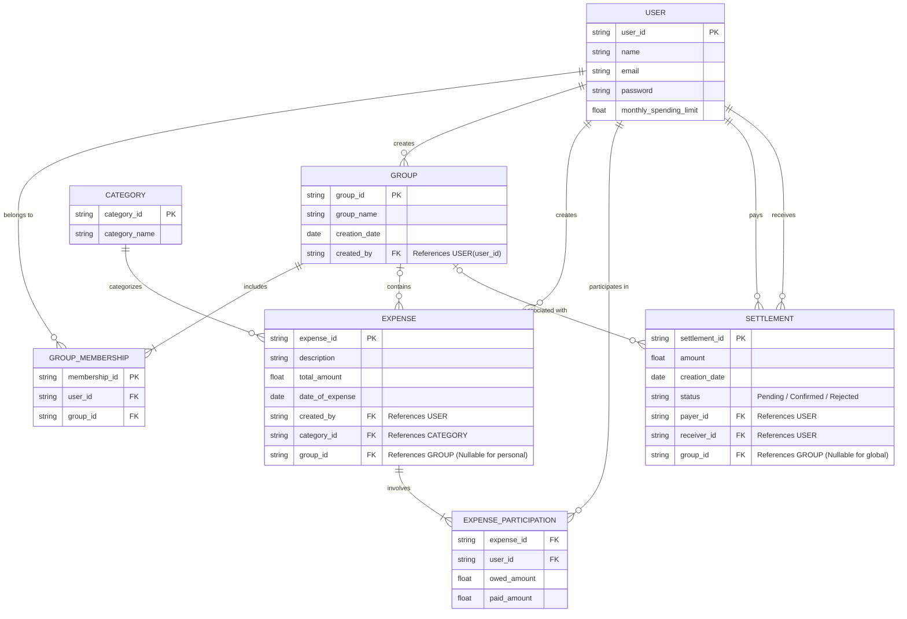

# SplitSmart - Group Expense Sharing & Personal Expense Tracking

A modern, fully-functional web application for managing group expenses and personal spending with an intuitive interface and comprehensive features.


## 🌟 Overview

**SplitSmart** is a comprehensive expense sharing platform that helps individuals and groups track expenses, split bills fairly, and settle debts efficiently. Built as a Single Page Application (SPA) with vanilla JavaScript, it provides a seamless user experience without requiring any backend infrastructure.

## ✨ Features Implemented

### 🔐 User Account Management
- ✅ User registration and login
- ✅ Profile management (name, email)
- ✅ Password change functionality
- ✅ Session management

### 👥 Group Management
- ✅ Create and manage groups
- ✅ Add/remove members from groups
- ✅ **Edit group members (Creator only)**
  - Add new members by email
  - Remove existing members
  - Visual indicators for changes
  - Creator and self cannot be removed
- ✅ View group details with tabs:
  - Members list with creator designation
  - Group expenses history
  - Balance summary within the group
- ✅ Leave group functionality
- ✅ Multiple group membership support

### 💰 Expense Tracking

#### Personal Expenses
- ✅ Create personal expenses (no group association)
- ✅ Categorize expenses (Food, Transport, Entertainment, etc.)
- ✅ Track monthly spending
- ✅ View personal expense history

#### Group Expenses
- ✅ Create expenses within groups
- ✅ Multiple payer support (different users contributing to same expense)
- ✅ Flexible split mechanisms:
  - **Equal Split**: Divide expense equally among participants
  - **Manual Split**: Custom amounts for each participant
- ✅ Participant selection (exclude specific members from expenses)
- ✅ Edit and delete expenses (by creator only)
- ✅ View detailed expense information

### 🤝 Settlement System
- ✅ Create settlement requests
- ✅ Three-state settlement system:
  - **Pending**: Awaiting receiver confirmation
  - **Confirmed**: Both parties agreed
  - **Rejected**: Receiver declined
- ✅ Global settlements (across all groups)
- ✅ Group-specific settlements
- ✅ Settlement history tracking
- ✅ Confirm/reject settlement functionality

### 📊 Balance Calculation
- ✅ Real-time balance calculation
- ✅ Cumulative group balance computation
- ✅ Individual balance tracking (who owes whom)
- ✅ Dashboard balance summary
- ✅ Group-wise contribution summary
- ✅ Automatic balance updates after settlements

### 💳 Monthly Spending Limit
- ✅ Set monthly spending limits
- ✅ Visual progress bar showing limit usage
- ✅ Warning system when approaching limit (80%+)
- ✅ Dashboard alert for limit warnings
- ✅ Percentage-based tracking

### 🎯 Additional Features
- ✅ Quick Add Expense button on dashboard
- ✅ Recent expenses widget
- ✅ Statistics cards (Total Expenses, Owed, Owing, Active Groups)
- ✅ Expense filtering (by group, category, search)
- ✅ Tab-based navigation (All/Personal/Group expenses)
- ✅ Responsive design (mobile, tablet, desktop)
- ✅ Toast notifications for user actions
- ✅ Category icons for visual identification
- ✅ Date formatting and currency display
- ✅ Empty state messages
- ✅ Loading screen

## 🎨 User Interface

### Pages & Navigation
1. **Dashboard** - Overview with stats, recent expenses, and balances
2. **Groups** - Grid view of all groups with statistics
3. **Expenses** - Comprehensive expense list with filters
4. **Settlements** - Manage payment settlements
5. **Profile** - User settings and monthly limit configuration

### Modals
- Create/Edit Group
- Add/Edit Expense (with advanced split options)
- Create Settlement
- Group Details (with member/expense/balance tabs)

## 🚀 Getting Started

### Prerequisites
- Modern web browser (Chrome, Firefox, Safari, Edge)
- No server or database required - runs entirely in the browser

### Installation

1. Clone or download the project files
2. Open `index.html` in your web browser
3. Start using the application immediately!

### Demo Login Credentials
```
Email: john.doe@example.com
Password: (any password)
```

Or create a new account using the signup page.

## 📁 Project Structure

```
splitsmart/
├── index.html              # Main HTML file with all pages and modals
├── css/
│   └── style.css          # Complete styling with responsive design
├── js/
│   ├── data.js            # Mock data and helper functions
│   └── app.js             # Main application logic and interactivity
└── README.md              # This file
```

## 🛠️ Technical Architecture

### Frontend Stack
- **HTML5**: Semantic markup with accessibility features
- **CSS3**: Modern styling with CSS variables and flexbox/grid
- **Vanilla JavaScript**: No frameworks, pure ES6+ JavaScript

### Design Patterns
- **Single Page Application (SPA)**: Client-side routing
- **State Management**: Centralized AppState object
- **Component-Based**: Reusable UI components
- **Event-Driven**: Event listeners for user interactions

### Key Technologies
- CSS Grid & Flexbox for layouts
- CSS Variables for theming
- LocalStorage ready (currently using in-memory mock data)
- Font Awesome icons
- Google Fonts (Inter)

## 🗄️ Database Architecture

SplitSmart uses a dynamic relational database model to ensure tracking granularity.

### Entity-Relationship Diagram



### Key Data Constraints & Integrity Rules
- The sum of all `owed_amount` across an expense's participation records must exactly match the expense's `total_amount`.
- A user's `owed_amount` and `paid_amount` cannot be negative.
- Settlements require that the Payer and the Receiver are two different users.
- If an expense is linked to a group, users participating in that expense must exist within that group's `GROUP_MEMBERSHIP` records.

## 📊 Data Models

### User
```javascript
{
  id: string,
  name: string,
  email: string,
  monthlyLimit: number
}
```

### Group
```javascript
{
  id: string,
  name: string,
  createdBy: userId,
  createdAt: timestamp,
  members: [userId]
}
```

### Expense
```javascript
{
  id: string,
  description: string,
  totalAmount: number,
  date: timestamp,
  createdBy: userId,
  categoryId: string,
  groupId: string | null,
  participants: [
    {
      userId: string,
      amountOwed: number,
      amountPaid: number
    }
  ]
}
```

### Settlement
```javascript
{
  id: string,
  payerId: userId,
  receiverId: userId,
  amount: number,
  status: 'pending' | 'confirmed' | 'rejected',
  groupId: string | null,
  createdAt: timestamp
}
```

### Category
```javascript
{
  id: string,
  name: string,
  icon: emoji
}
```

## 🧮 Balance Calculation Logic

The application calculates balances using a sophisticated algorithm:

1. **For each expense**:
   - Calculate what each participant owes
   - Track what each participant paid
   - Distribute payments proportionally

2. **Balance between two users**:
   ```
   Balance = (What User A paid for User B) - (What User B paid for User A)
   ```

3. **Apply confirmed settlements** to adjust balances

4. **Group balances** are calculated independently for each group

5. **Global balances** consider all groups together

## 🎯 Core Algorithms

### Split Calculation
- **Equal Split**: `totalAmount / numberOfParticipants`
- **Manual Split**: User-defined amounts (must sum to total)
- **Multi-Payer**: Each payer's contribution is tracked separately

### Settlement Processing
1. User creates settlement request
2. Receiver must confirm or reject
3. Upon confirmation, balance adjusts automatically
4. Settlement history is maintained for auditing

## 🎨 Design Features

### Color Scheme
- Primary: Blue (#3b82f6)
- Secondary: Purple (#8b5cf6)
- Success: Green (#10b981)
- Danger: Red (#ef4444)
- Warning: Orange (#f59e0b)

### Responsive Breakpoints
- Mobile: < 480px
- Tablet: 480px - 768px
- Desktop: 768px - 1024px
- Large Desktop: > 1024px

### Accessibility
- Semantic HTML elements
- ARIA labels where appropriate
- Keyboard navigation support
- High contrast ratios
- Focus indicators

## 📱 Mobile Responsiveness

- Adaptive navigation (icons only on mobile)
- Touch-friendly buttons and interactions
- Optimized layouts for small screens
- Swipe-friendly card designs
- Collapsible sections

## 🔒 Security Considerations

**Note**: This is a frontend-only demo application with mock data.

For production use, implement:
- Backend API with proper authentication (JWT, OAuth)
- Database for persistent storage
- Input validation and sanitization
- HTTPS encryption
- Rate limiting
- CSRF protection
- Secure password hashing

## 🚀 Future Enhancements

### Not Yet Implemented
- [ ] Real backend API integration
- [ ] Database persistence
- [ ] Email notifications for settlements
- [ ] Receipt/image upload for expenses
- [ ] Export data (CSV, PDF)
- [ ] Recurring expenses
- [ ] Budget tracking by category
- [ ] Currency conversion
- [ ] Charts and analytics
- [ ] Activity feed
- [ ] Multi-language support
- [ ] Dark mode

### Recommended Next Steps

1. **Backend Development**
   - Create RESTful API (Node.js/Express, Python/Django, etc.)
   - Implement authentication system
   - Set up database (PostgreSQL, MongoDB)

2. **Enhanced Features**
   - Real-time notifications using WebSocket
   - Email service integration
   - Cloud file storage for receipts

3. **Data Visualization**
   - Integrate Chart.js for expense analytics
   - Category-wise spending breakdown
   - Monthly spending trends

4. **Mobile Apps**
   - React Native or Flutter for mobile versions
   - Push notifications
   - Offline support

5. **Testing**
   - Unit tests (Jest, Mocha)
   - Integration tests
   - E2E tests (Cypress, Playwright)

## 📝 Usage Examples

### Creating a Group Expense
1. Navigate to Groups page
2. Click "Create Group"
3. Enter group name and add members
4. Go to Expenses page
5. Click "Add Expense"
6. Select the group
7. Choose split method (equal or manual)
8. Select participants
9. Save expense

### Settling Up
1. Go to Settlements page
2. Click "Create Settlement"
3. Select person to pay
4. Enter amount
5. Optionally select group
6. Submit (receiver must confirm)

### Setting Monthly Limit
1. Go to Profile page
2. Enter your monthly spending limit
3. Monitor progress on dashboard
4. Receive warnings when approaching limit

## 🐛 Known Issues

- None currently - application is fully functional with mock data

## 📄 License

This project is provided as-is for educational and demonstration purposes.

## 👨‍💻 Development

### Code Structure
- **Modular Functions**: Each feature is broken into manageable functions
- **Event Delegation**: Efficient event handling
- **Data Helpers**: Utility functions for data manipulation
- **Clean Code**: Well-commented and readable

### Adding New Features
1. Add UI elements in `index.html`
2. Style components in `css/style.css`
3. Implement logic in `js/app.js`
4. Update mock data in `js/data.js` if needed

## 🤝 Contributing

To contribute:
1. Fork the repository
2. Create a feature branch
3. Make your changes
4. Test thoroughly
5. Submit a pull request

## 📞 Support

For issues or questions:
- Check this README documentation
- Review the inline code comments
- Test with provided demo credentials

## 🎉 Acknowledgments

- Font Awesome for icons
- Google Fonts for Inter typeface
- Modern CSS techniques for responsive design
- JavaScript ES6+ features for clean code

---

**Built with ❤️ using Vanilla JavaScript, HTML5, and CSS3**

*Last Updated: 2024-03-14*
